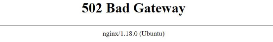

# 502 Bad Gateway
[Google Cloud Nightscout](../) >> 502 Bad Gateway  
  
Do you encounter this error when attempting to access your Nightscout in a browser?  
   
  
  
   
   

---  
  
It’s not unusual to see this error.  It could occur if you have just restarted your virtual machine.  
Please be patient and give it a minute or two.  
   

---  
  
This issue could also happen if you ran the bootstrap process but did not follow it with the "Install Nightscout Phase 1" step.  

To resolve the issue:  
1- Check the [status page](./Status.md).  
- If you see “Missing node_modules” highlighted in red, you need to run “Install Nightscout Phase 1” from the Google Cloud Setup submenu.  

2- After completing the installation, [restart the server](./Restart.md).  

If the problem persists after the restart, please [contact us](./GCNS_Support.md) for further assistance.  
  
  
  
