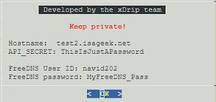

# Google Cloud Nighscout API_SECRET
[Google Cloud Nightscout](./GoogleCloud.md) >> What is my API_SECRET?  
  
If you have forgotten the API_SECRET, go to the [status page](./Status.md).  At the bottom, choose "Hostname and password".  
You will be taken to a page where you can see your hostname and API_SECRET assuming you have completed [installation](./GoogleCloud.md).  An example is shown below.  
  
  
  
