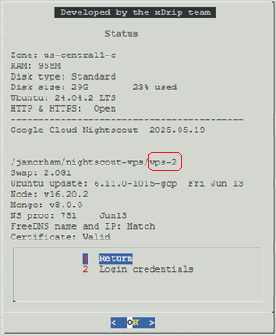

# Google Cloud Nightscout branches
[Google Cloud Nightscout](./GoogleCloud.md) >> Branches  
  
Google Cloud Nightscout has two branches that you can use:  
  
* Development Branch (vps-dev): This branch receives updates first and is therefore less tested. You can access the latest updates sooner with this branch.  
  
* Stable Branch (vps-2): This branch is updated after new features have been tested on the development branch for a while. It is updated by promoting a release from the development branch and is therefore more stable.  
   
  
---  
  
#### **Updates**  
When you [update the platform](./NS_SyncExecutables.md), you receive the latest release in the branch you are using.  
   
  
---  
  
#### **Comparison**  
To see the differences between the two branches, refer to the [release notes](./GC_ReleaseNotes.md).  
   
  
---  
    
#### **Switching Branches**  
If you want to switch branches while using Google Cloud Nightscout, follow these instructions:  

1- To switch from the dev branch to the stable branch, copy the following command:  
<input type="text" value="curl https://raw.githubusercontent.com/jamorham/nightscout-vps/vps-2/bootstrap.sh | bash" readonly  
       id="myInputText1"  
       style="border:none; color:#101010; background-color:#ededed; width:100%; font-size:15px">  
<button onclick="copyText('myInputText1', 'msg')"   
        style="border: 1px solid #0066ff; color:#f0f0f0; background: linear-gradient(#0066ff, #0066ff); font-size:14px; font-weight:400; border-radius: 2px; margin-left:70px;  margin-top:8px; padding:4px 12px; display:inline-block; box-shadow: inset 0px 1px 0px rgba(255,255,255,.3), 0px 1px 5px rgba(0,0,0,.7);">Copy</button>  
Copied!  
   
To switch from the stable branch to the dev branch, copy the following command:  
<input type="text" value="curl https://raw.githubusercontent.com/jamorham/nightscout-vps/vps-dev/bootstrap.sh | bash" readonly  
       id="myInputText2"  
       style="border:none; color:#101010; background-color:#ededed; width:100%; font-size:15px">  
<button onclick="copyText('myInputText2', 'msg')"   
        style="border: 1px solid #0066ff; color:#f0f0f0; background: linear-gradient(#0066ff, #0066ff); font-size:14px; font-weight:400; border-radius: 2px; margin-left:70px;  margin-top:8px; padding:4px 12px; display:inline-block; box-shadow: inset 0px 1px 0px rgba(255,255,255,.3), 0px 1px 5px rgba(0,0,0,.7);">Copy</button>  
   
  
2- Paste the command into the virtual machine [terminal](./Terminal.md).  
3- Press Enter to execute the bootstrap.  
4- From the Google Cloud setup submenu, run “Install Nightscout Phase 1.”  
5- [Restart the server](./Restart.md) to ensure everything works correctly.  
  
After switching branches:  
- If issues arise, run “Install Nightscout Phase 2.”  
  - You will be prompted to update the API_SECRET—press ESC to keep it unchanged.  
  - You will also be asked for FreeDNS account credentials—press ESC to retain the current hostname.  
   
  
---  
   
#### **Which branch am I using?**  
To determine which branch you are using, go to the status page. The full GitHub path is displayed on the status page, and the last section of the line indicates vps-2 for the stable branch or vps-dev for the development branch.   
  
   
  
---  
  
#### **Which branch should I use?**  
The choice of branch depends on your needs:  
  
Use the development branch if you are confident with technology and are willing to contribute by testing.  
Use the development branch if you need a feature that is only available there.  
Use the stable branch if you prefer stability and the stable release meets all your needs.  
  
