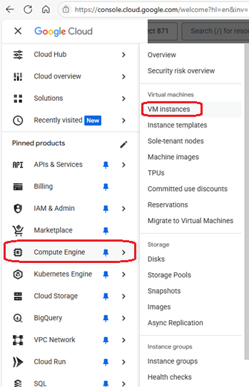

# Google Cloud Compute Engine VM instances
[Google Cloud Nightscout](./GoogleCloud.md) >> Compute Engine VM instances  
  
Go to [Google Cloud](https://cloud.google.com/).  
Sign in.  
Click on "Console".  
  
   
  
From the main menu (top left corner), select VM instances through the Compute Engine submenu.  
  
  
  
  
