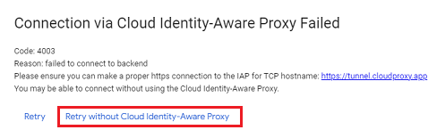

# Connection via Cloud Identity-Aware Proxy Failed
[Google Cloud Nightscout](../) >> [Troubleshooting](./GCNS/Troubleshooting.md) >> Cloud Identity-Aware  
  
When you use SSH to connect to the virtual machine, you may get this error:  
  
  
You can click on "Retry without Cloud Identity-Aware Proxy" to connect.  
  
