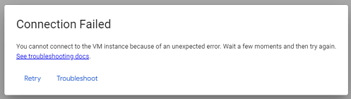

# Virtual machine connection failed
[Google Cloud Nightscout](./GoogleCloud.md) >> Connection Failed  
  
You may experience a connection failed error.  
  
  
That will be an expected error after a reboot.  You are remotely connected to a virtual computer.  When you reboot that computer, you cannot still be connected to it.  
Wait 30 seconds;  then, click on retry to reconnect.  

You may even experience the error unexpectedly.  
Wait 30 seconds;  then, click on retry to reconnect.  
  
