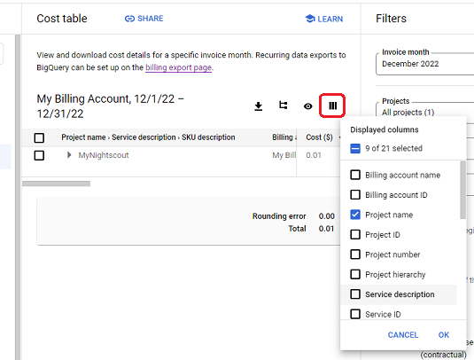
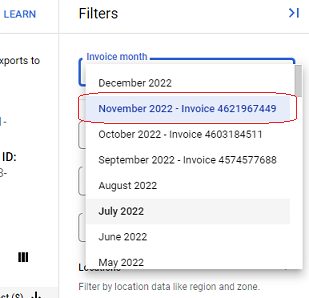
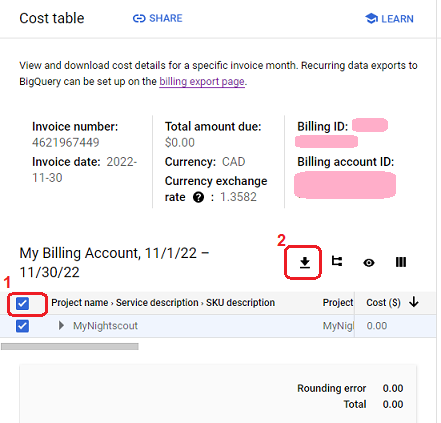
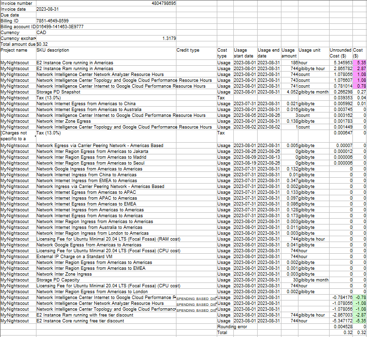

# Google Cloud Cost Table
[Google Cloud Nightscout](../) >> Cost Table  
  
You can get a categorized list of costs from Google Cloud even before your free trial period ends.  You must have [created a Google Project and activated billing](./NS_GCProject.md) for this to work.  
   

---  

#### **How to create a cost table**  
Go to [Billing](./Billing.md).  
  
Click on "Cost table" in the left pane.  Click on "Column display options".  
  
  
Disable all options except the following:  
  
Project name  
SKU description  
Credit type  
Cost type  
Usage start date  
Usage end date  
Usage amount  
Usage unit  
Unrounded Cost ($)  
  
Click on OK.  
  
Choose an invoice.  Keep in mind that an invoice may only become complete on the second or third day of the month.  So, the invoice for December, will not yet be valid on January 1.  
  
  
Put a check mark beside project name.  Then, click on "Download CSV".  
  
  
   
  
---  
  
#### **How to use the cost table**  
Open the csv file you downloaded.  If you don't have Excel, you can use Open Office (free).  
  
  
For many of the costs listed in the table at the top, you will see corresponding credits, due to free tier, in the table at the bottom.  Those have been highlighted in pink and green in the example table shown above respectively.   Ignoring those, what remains will be what you are charged for.  
In case of the cost table shown above, that is the $0.27 cost due to snapshots.  
  
See what the SKU description is for each.  If it is unexpected, please [contact us](./GCNS_Support.md).  

Any credit listed as "free tier" is independent of your free trial.  Even after your free trial period ends, all free tier credits remain and stay in effect.  
  
  
