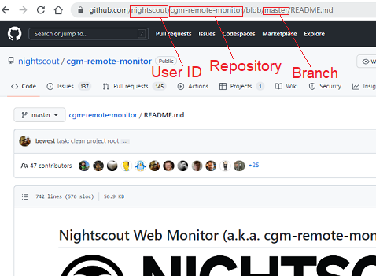

# Customize Nightscout
[Google Cloud Nightscout](./GoogleCloud.md) >> Customize  
  
You need to have completed the Nightscout [installation](./NS_Install.md) steps before using this utility.  
You can use it to install from a GitHub fork created from the development branch of the official Nightscout repository in order to update to the development branch.  
  
You could also cutomize your fork.  There is no guarantee that this will be successful.  If the fork you install from has errors, you will not have a working system.  
What could be even worse is if you end up with a working system that provides erroneous information.  Please proceed at your own risk.  
  
**During the process, which takes about 25 minutes, your Nightscout will not be operational.**  
  
To proceed, select "Customize Nightscout" from the [menu](./Menu.md) and enter.  
In a minute, the following dialog will show.  
  
  
The following image shows the official Nightscout page on GitHub.  The user ID, repository and branch fields are identified in the image.  
  
  
Enter the user ID, repository name and branch name to install from.  You can use the arrow keys to move the cursor to different fields.  
Then, use tab to move the cursor to Submit or cancel.  
After submitting, Nightscout will be installed from the fork you have selected.  
The installation will take about 25 minutes.  
  
If you proceed, you will see progress in the terminal for a while.  Then, you will see no change in the terminal for 20 minutes.  You need to be patient.  
  
After installation is complete, the virtual machine will reboot automatically.  Your terminal will show an error.  This is expected.  However, if there is an SSH disconnect random error, you will observe the exact same behavior.  
Wait 30 seconds, and click on retry to reconnect.  View the logs by selecting "Logs" from the main menu.  If you see a log starting with "Nightscout customization completed" as the last log with the correct universal time, customization succeeded.  On the other hand, if you don't see such a log, there must have been a random disconnect.  In that case, you will need to repeat the customization process.  
   
  
---  

#### **Undoing the customization**  
To switch back to the official version of Nightscout, with no customization, run bootstrap, Phase 1 and Phase 2 as described on the [installation page](./NS_Install.md).  
  
