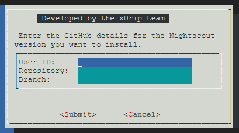
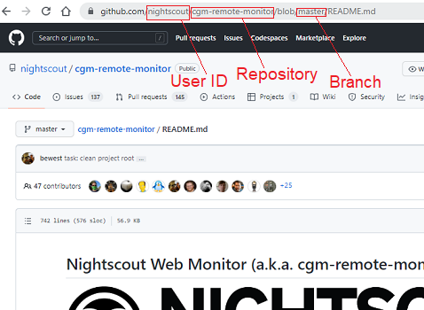

# Customize Nightscout
[Google Cloud Nightscout](../) >> [Utilities](./GCNS/Utilities.md) >> Customize Nightscout  
  
You need to have completed the Nightscout [installation](./NS_Install.md) steps before using this utility.  
  
**There is no guarantee that this will be successful.  Your Nightscout may stop working.  It is strongly recommended that you create a [backup](./DatabaseBackup.md) before proceeding.  Continue at your own risk.**  
  
You can use this utility to install Nightscout from a customized GitHub fork of the official repository.
During the process, which takes about 25 minutes, your Nightscout will not be operational.  
  
To proceed, select "Customize Nightscout" from the "Nightscout setup" [submenu](./Menu.md) and enter.  
Within a minute, the following dialog will appear.  
  
  
The following image shows the official Nightscout page on GitHub.  The user ID, repository, and branch fields are highlighted.  
  
  
Enter the user ID, repository name, and branch name to install from.  
  
After submitting, Nightscout will be installed from the fork you have selected.  
The installation will take about 25 minutes.  
  
If you proceed, you will see progress in the terminal for a short time. Then, there may be no visible activity for about 20 minutes. This is normal—please be patient.  
  
After installation is complete, reboot the server.  
Wait 30 seconds, and click on retry to reconnect.  View the logs by selecting "Logs" from the main menu.  If you see a log starting with "Nightscout customization completed" as the last log with the correct universal time, customization succeeded.  
If this log entry is missing, a random disconnect likely occurred, and you will need to repeat the customization process.  
   
  
---  

#### **Undoing the customization**  
To revert to the official, unmodified version of Nightscout, run bootstrap, Phase 1, and Phase 2 as described on the [installation page](./NS_Install.md).  
  
