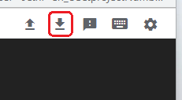

# Google Cloud Nightscout Backup
[Google Cloud Nightscout](../) >> [Utilities](./GCNS/Utilities.md) >> Backup  
  
You must have Nightscout [installed and operational](./GoogleCloud.md) for this to work.  
A video tutorial is included to complement the instructions.  
  
**Backup**  
Open a [terminal](./Terminal.md), and select "Backup MongoDB and variables" from the **Data** submenu.  
A compressed archive file will be created in the current directory, with the name you choose, containing both the MongoDB database and your variables.  
  
**Transfer the backup**  
To prevent loss if the virtual machine is deleted, transfer the backup off the machine.  
Once the backup is complete, the full path to the backup file will be displayed on screen—copy it.  
If the path is not displayed, exit the menu and run the following command in the terminal:  
`pwd`  
Copy the result, then append the name of your backup file:  
`/Filename`  
This gives you the full absolute file path.  
  
Click **“Download File”** at the top of the terminal.    
  
  
Enter the full path to the backup file, then click **“Download”** to start the transfer to your local device.  
  
If the terminal disconnects during the download and shows a [disconnect error](./images/Disconnect.png), wait a moment and click **“Retry”** to reconnect. Then, try downloading again.  
  
Ensure you store the backup file in a safe location.  
  
<video width="400" controlsList="nodownload" src="./video/Backup.mp4" controls>  
</video>  
  
   
  
---  
  
[Restore](./DatabaseRestore.md)  
  
