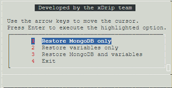

# Google Cloud Nightscout Restore
[Google Cloud Nightscout](./GoogleCloud.md) >> Restore  
  
You must have Nightscout [installed and functional](./GoogleCloud.md) for this to work.  
  
Open a [terminal](./Terminal.md).  
Click on "Upload" at the top of the terminal.  
  
Click on “Choose Files”. Select the backup file you [created](./DatabaseBackup.md) and click on “Upload”.  
  
The file will be uploaded to the virtual machine’s working directory.    
  
Type `menu` and press Enter to bring up the [menu](./Menu.md).  
  
Choose “Restore MongoDB and/or variables” from the Data submenu.  
  
Select the backup file and press the space bar to add it. The full path to the file will appear at the bottom. Press Enter to proceed with the restore.  
  
You will see a menu offering options for restoration.  
  
  
If the backup contains both MongoDB data and variables, you can choose to restore one or both.  
  
If you restore the **MongoDB database**, the backup content will be merged into the existing database.  
If you restore **variables**, your **API_SECRET** will be overwritten by the one in the backup.  
   
  
---  
  
[Backup](./DatabaseBackup.md)  

  
