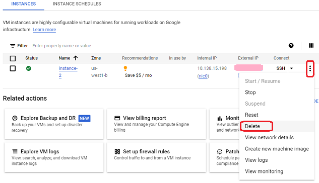

# Delete virtual machine
[Google Cloud Nightscout](./GoogleCloud.md) >> Delete virtual machine  
  
**Warning!:** If you delete a virtual machine, all the data on it, including your MongoDB, will be deleted.  There will be no way to undo that.  
Therefore, deleting a virtual machine should be a last resort.  
  
If you need to delete a virtual machine, it is a good idea to create a [backup](./DatabaseBackup.md).  Creating a backup also backs up your variables if you are using a version newer than 2023.02.28.  
  
If you have just created the machine, you can delete it with no worries as you have not added any data to the machine.  
  
Go to the [Compute Engine](./ComputeEngine.md).  
  
Choose "Delete" from the 3-dot menu.  
  
  
  
