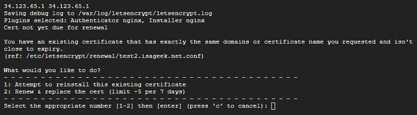

# Existing Certificate
[Google Cloud Nightscout](../) >> [Troubleshooting](./GCNS/Troubleshooting.md) >> You have an existing certificate that has exactly the same domain  
  
If you run "install Nightscout phase 2" again shortly after having run it before, you may get a note claiming that there is an existing certificate.  
  

This may be required if "install Nightscout phase 2" fails the first time.  

If you experience this, choose 2.  
  
