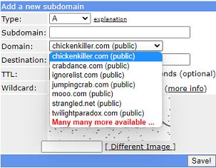
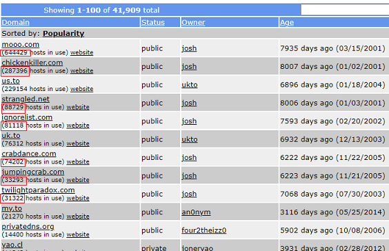
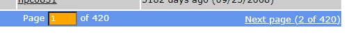

# FreeDNS blocked domains
[Google Cloud Nightscout](./GoogleCloud.md) >> FreeDNS blocked domains  
  
It has been reported that some hostnames are blocked by some schools or work networks.  If you experience this, ask if the school or workplace can add your hostname to their safe list.  
Otherwise, it may be best to choose a domain that is not too popular.  You can have a total of 5 different FreeDNS subdomains for free whether they are all on the same domain or not.  So, creating a second hostname will be free.  
  
Please log into [FreeDNS](https://freedns.afraid.org/menu/).  Go to [subdomains](https://freedns.afraid.org/subdomain/).  Click on Add.  You will see the following from the domain pulldown menu.  
  
  
The 7 options at the top are the options owned by the FreeDNS owner.  Please click on "Registry" in the left pane.  
  
At the top of the page, you can see the 7 previously mentioned domains.  
  
You can see the number of users under each listing.  mooo.com has more than half a million users.  It is not surprising that some routers may block it.  
  
Go to [https://urlfiltering.paloaltonetworks.com/query/](https://urlfiltering.paloaltonetworks.com/query/).  
Enter mooo.com and click on search.  You will see that it is categorized as high risk.  
You can also try [https://www.virustotal.com/gui/home/url](https://www.virustotal.com/gui/home/url)  
  
On the registry page of FreeDNS, scroll down to the bottom of the page.  There are more than 400 pages!  
  
  
Go through the pages and find a public domain that is categorized as low risk when you test using the links provided above.  Also take into account the number of users and the domain age.  You may be better off if you choose a domain that doesn't have tens of thousands of users.  
  
After selecting a domain, click on it in the left column.  Doing that takes you back to the subdomain page with the domain selected.  Now, enter a subdomain and proceed to activate it and create a hostname as explained [here](./FreeDNS.md).  
  
In order to switch to using your new hostname, on a complete setup, please rerun "Install Nightscout phase 2" from the Google Cloud setup submenu.  
On the other hand, if you are just setting up a system, please continue [here](./FreeDNS.md) to complete creating your hostname.  
