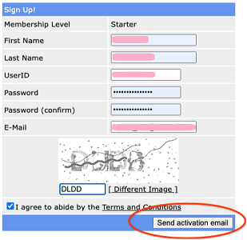
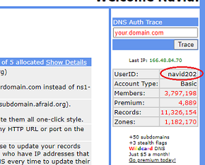
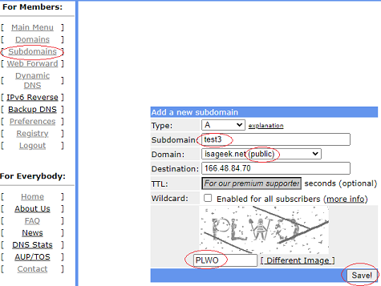
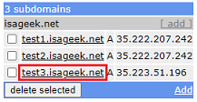

# Free DNS
[Google Cloud Nightscout](../) >> FreeDNS  

Follow these instructions in order to use FreeDNS, which you will need in order to set up Google Cloud Nightscout.  
You will need 5-10 minutes to complete this.  

After everything is set up and working, you will need to log into your FreeDNS account at least once every 6 months, or when you receive a reminder email from them, as explained [here](./FreeDNS_Min_Login.md).  
   
  
---  

#### **Creating an account**  
Go to FreeDNS site: [https://freedns.afraid.org/](https://freedns.afraid.org/)  
Click on Sign up Free, and sign up.  Make sure to choose a user ID excluding capital letters.  
If you include capital letters in your user ID, FreeDNS will convert them all to lowercase.  
Don't include any of the following characters in your password.  

$ &nbsp; &nbsp; \" &nbsp; &nbsp; \' &nbsp; &nbsp; \\  &nbsp; &nbsp; SPACE &nbsp; &nbsp; @ &nbsp; &nbsp; /  
  
Please remember your user ID and password.  
  
Send activation email.  
  
Open email and activate your account.  
**Set up your email client not to filter the email, from FreeDNS, as junk/spam.  You will receive an email from them once every 5.5 months as a reminder to log into your FreeDNS account to keep your account active.**  
  
To log in, click on "Main Menu" under "For Members".  
After logging in, you can see your user ID at the top right corner.  
  
  
   

---  

#### **Choosing a domain**    
Go to [Subdomains](https://freedns.afraid.org/subdomain/).  
Add.  
  
Under "Domain", you have 7 options.  Those 7 domains are less likely to be disabled some time in the future.  However, some schools or workplaces may block those domains.  

If your school or workplace blocks your domain, try what is suggested [here](./FD_Domains.md).  
If you don't experience any issues at work or school, using one of the 7 main domains may be better to avoid the possibility of the domain going down at some point in the future.  
  
If the domain you are using is ever disabled, resolve the problem by creating a new subdomain on a different domain and [switching to it](./ChangeHostname.md).  
  
After having selected a public domain, please proceed with creating a subdomain.  
   
  
---  
  
#### **Creating a subdomain**    
Enter a subdomain name.  Under the image, enter text (capital) to capture the image you see.  You can change the image if it's not clear.  
Save.  
  
   
  
Now, if you go to [Subdomains](https://freedns.afraid.org/subdomain/), you will see your new hostname:  
  
That is what you will be using to access your Nightscout in a web browser.  
  
