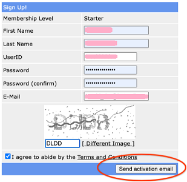
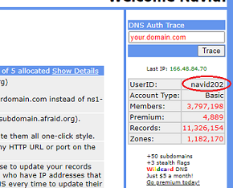
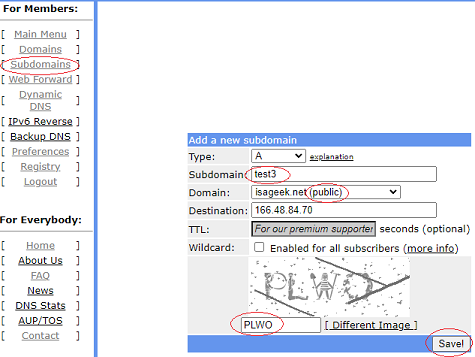
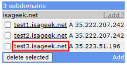

# Free DNS
[Google Cloud Nightscout](../) >> FreeDNS  

Follow these instructions to set up FreeDNS, which is required to configure your Google Cloud Nightscout instance.  
This process typically takes 5–10 minutes.  

Important: To keep your account active, you must log in to FreeDNS at least once every six months.  FreeDNS will send a reminder email, or you can read more about the requirements [here](./FreeDNS_Min_Login.md).    
   
  
---  

#### **Creating an account**  
Go to FreeDNS website: [https://freedns.afraid.org/](https://freedns.afraid.org/)  
Click on Sign up Free, and sign up.  Choose a User ID using only lowercase letters.   
Do not include any of the following characters in your password:  

$ &nbsp; &nbsp; \" &nbsp; &nbsp; \' &nbsp; &nbsp; \\  &nbsp; &nbsp; SPACE &nbsp; &nbsp; @ &nbsp; &nbsp; /  
  
Please record your User ID and password for future use.  
  
Click to send the activation email.  
  
Check your inbox and click the link in the email to activate your account.  
**Set up a recurring (once every six months) calendar reminder to log in to your FreeDNS account. This ensures your subdomain remains active.**  
  
To log in later, click on "Main Menu" under "For Members".  
Once logged in, your User ID will be visible in the top right corner.  
  
  
   

---  

#### **Choosing a domain**    
Navigate to the [Subdomains](https://freedns.afraid.org/subdomain/) page.  
Click Add.  
  
Under the "Domain" dropdown, you will see several options.  The "top 7" domains are generally more stable and less likely to be disabled in the future.  However, some school or corporate networks may block these common domains.  

If your domain is blocked, refer to the suggestions [here](./FD_Domains.md).  
If you have no connectivity issues, using one of the 7 main domains is recommended for long-term stability.  
  
If your domain is ever disabled, you can resolve this by creating a new subdomain on a different domain and [switching your setup to it](./ChangeHostname.md).    
   
  
---  
  
#### **Creating a subdomain**    
Subdomain:  Enter your desired name using only lowercase letters and no special characters.  
Domain:  Select your chosen domain from the previous step.  
CAPTCHA:  Enter the text exactly as it appears in the image.  You can change the image if it is difficult to read.  
Click Save.  
  
   
  
To verify your setup, go back to the [Subdomains](https://freedns.afraid.org/subdomain/) page.  You will now see your new hostname:  
  
This hostname is the URL you will use to access your Nightscout site in a web browser.  
  
