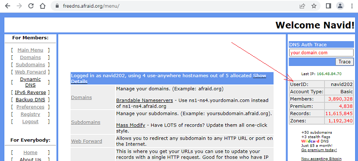

# FreeDNS login  
[Google Cloud Nightscout](./GoogleCloud.md) >> How to log in to your FreeDNS  
  
Go to [https://freedns.afraid.org/](https://freedns.afraid.org/).  
If you are not logged in already, you will see this.  
  
  
Click on "Main Menu" under "For Members".  You will be presented with the login option as shown below.  
  
  
Enter the email address and password you used to sign up with FreeDNS when you completed the [first step of installation](./FreeDNS.md).  

After you log in, if you click on "Main Menu" under "For Members", you will see what is shown below, where you can see your user ID in the right pane.  
  
  
