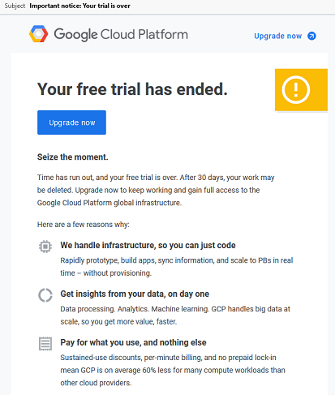
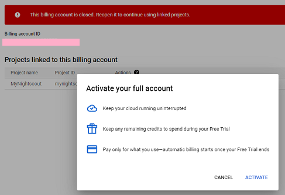
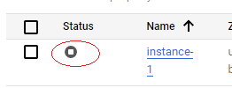
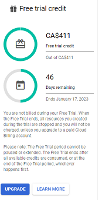
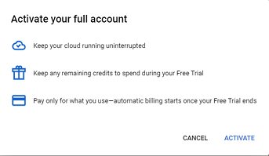
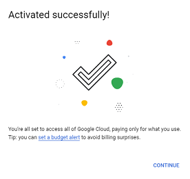
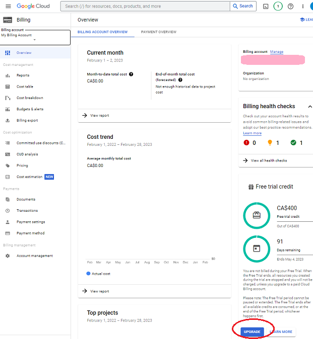
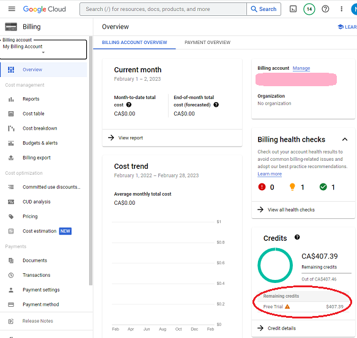
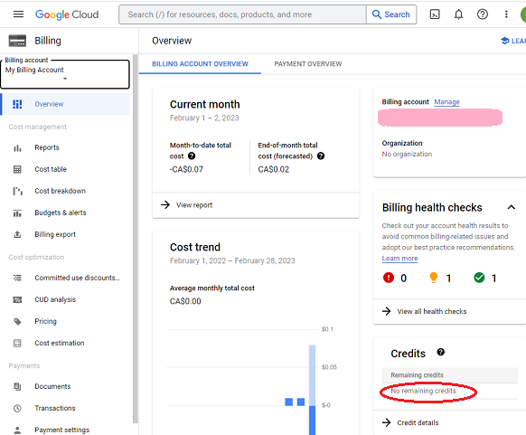

# Free Trial has ended - Upgrade your account
[Google Cloud Nightscout](./GoogleCloud) >> Free Trial End  
  
You should upgrade Google Cloud to avoid any surprises.  
If you don't upgrade, you will receive an email notification as shown below when your free trial ends.  Click on "Upgrade now".  
  
  
You may see the following.  Don't panic.  Click on "Activate".  
  
    
Go to the console and the Compute Engine.  You will see that the virtual machine has been stopped!  
  
  
Start it (one of the options under the 3-dot menu).  After the machine starts, you may notice that you still cannot access Nightscout.  This is because restarting the machine after it was shut down for a while has resulted in the machine IP address to have been changed.  
Please be patient.  It may take a minute or two, after restarting the virtual machine, for the new IP address to be associated with your hostname.    
   
  
---  
  
**Don't wait to upgrade**  
To avoid a surprise interruption in your Nightscout operation, upgrade before your free trial period ends.  
To do that, log into Google Cloud;  go to billing.  You will see the details of your free trial on the page.  Click on Upgrade.  
  
  
This will open the window shown below.  Click on Activate.  
  
  
  
  
You will not lose your remaining free credit.  You can use your remaining free credit up to its original expiry date.  
Since you have already upgraded, nothing will be interrupted when your free trial ends.  
As long as you satisfy the free tier requirements, everything will be free.  
   
  
---  
  
**How can I tell if I have already upgraded or not?**  
Log into Google Cloud.  Go to billing, from the dashboard.  Click on "Overview" in the left pane.  
  
If you see the option to upgrade as shown in the following image, you have not upgraded yet, and you can.  
  
  
If you see remaining credit shown, as shown in the following image, you have already upgraded. But, you still have time to use the remaining credit from your free trial.  If you click on credit details at the bottom, you can see how many days are left for you to use the remaining credit.  
  
  
If you see "No remaining credits" as shown in the following image, you have already upgraded and the free trial credit period has expired.  
  
  
