# Google Cloud Nightscout full disk
[Google Cloud Nightscout](./GoogleCloud.md) >> Restore a system with full disk  
  
If you created your setup a long time ago (August 2022) with a 10GB disk and never updated to increase the disk space to 30GB, your system will sooner or later stop working.  This happens because there are processes that generate logs and snapshots that occupy considerable space.  When the disk becomes full, SSH will not work anymore.  
The best solution is to update before the disk is full.  

The methodology described on this page to recover a system with a full disk is not easy.  Please [contact us](./GCNS_Support.md) if you don't feel confident to follow the instructions or if you need help.  
<br/>  
  
---  
  
#### **Snapshot**
Create a [snapshot](./Snapshots.md) of your Nightscout disk just in case something goes wrong.  
<br/>  
  
---    
  
#### **Increase Nightscout disk size from 10GB to 30GB**  
Go to [Compute Engine](./ComputeEngine.md).  
Under the heading "Name", click on the Nightscout instance name.  
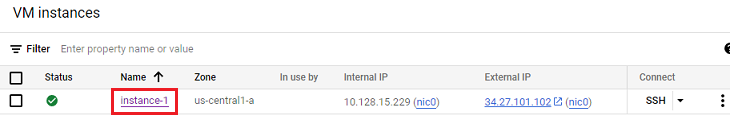  
  
Scroll down to "Storage".  After confirming that the disk space is 10GB, click on the disk name.  
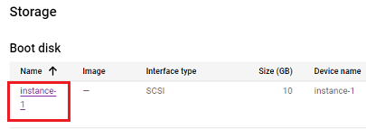  
  
Now, you need to expand your browser screen horizontally until you can see "Edit" at the top.  Click on "Edit".  
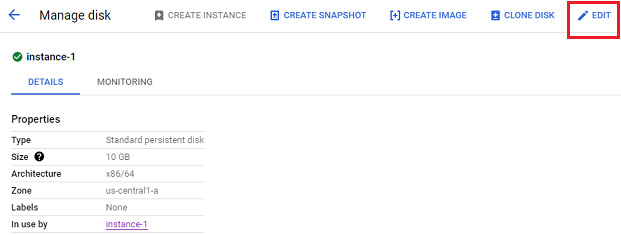  
  
Edit disk size.  
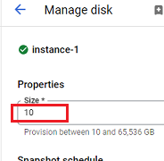  
  
Change it to 30GB and save.  
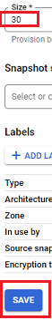  
<br/>  
  
You now need to [restart the server](./Restart.md) so that the file system uses the added disk space.  This is a critical step that should not be forgotten.  
<br/>  
<br/>  
  
---  
  
#### **Restore a system with a full 10GB  disk**
If you cannot connect to the virtual machine using SSH because the disk is full, even after increasing the disk size to 30GB, you may still not be able to connect.  
This is because Ubuntu needs to adjust the file system to use the added disk space.  But, if Ubuntu cannot start, it will not be able to do that.  
  
We are going to create another (recovery) instance to use temporarily to fix this problem.  
There may be a cost involved.  We will use what's needed to minimize cost.  Hopefully, it will be free.  
  
* 1- Detach Nightscout disk 
    * Stop the Nightscout instance using the 3-dot menu on the right side of the instance line on the Compute Engine page.  This may take up to 3 minutes to complete.  

    * Click on the stopped Nighscout instance name.  
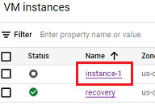  

    * Click on Edit at the top.  
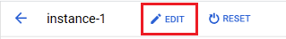  

    * Scroll down to "Storage".  Click on "Detach boot disk".  Click on "Save".  
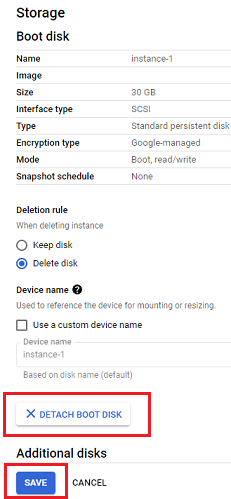  

* 2- Recovery instance  
    * Create a new recovery instance.  
Follow the same [guidelines](./VirtualMachine.md) for creating the main machine except there is no need to change the disk space to 30GB.  You can leave it at 10GB for the recovery machine.  

    * Use SSH to connect to the new machine.  This is very important.  Please don't skip this step.  

    * Go back to VM instances.  
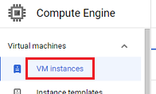  

    * Click on the recovery instance name.  
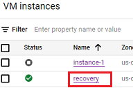  

    * Click on Edit at the top.  Scroll down to Storage.  Scroll further down to "Additional disks".  Click on "Attach existing disk".  If you see a note that there is no disk to attach, it means you did not detach the boot disk of your Nightscout instance.  Go back and do that.  
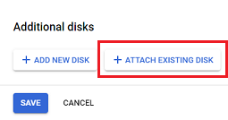  

    * From the pull-down menu, select the disk of your Nightscout instance.  Click on save.  That will save the disk setting of the instance.  But, you are still on the instance edit page.  Click on save again to finalize editing the instance.  
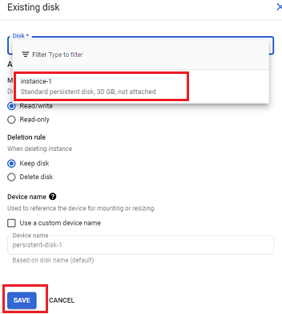  
Now, you have a new instance with two disks attached to it.  One is its boot disk.  The other is the problem disk that we are going to fix.  

* 3- Resize partition  
    * Go back to the VM instances page again.  Click on SSH on the temporary (recovery) instance line.  Wait for a terminal to pop up and the prompt to appear.  Type and enter the following in the terminal.  
```  
sudo lsblk  
```  
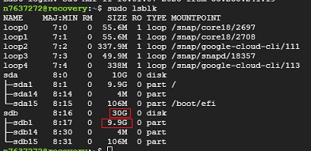  
sda is the boot disk of the temporary (recovery) instance.  sdb is the trouble disk.  
Even though sdb shows 30GB, sdb1, which is the partition containing Ubuntu and MongoDB still shows 9.9GB.  This is why we couldn't log into the Nightscout instance.  

    * Type and enter the following in the terminal.  
```  
sudo growpart /dev/sdb 1  
```  

    * Type and enter the following in the terminal.  In response to the prompt(s) for fix, press y to approve.  
```  
sudo e2fsck -f /dev/sdb1  
```  
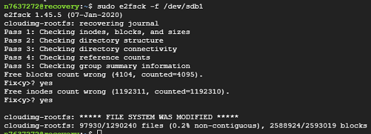  

    * Type and enter the following in the terminal.  
```  
sudo resize2fs /dev/sdb1  
```  

    * To verify, enter the following in the terminal again.  
```  
sudo lsblk  
```  
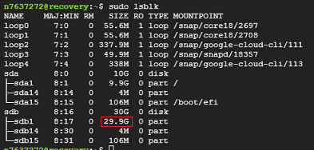  
You can see that partition sdb1 has grown to occupy the added disk space.  You can now exit (close) the terminal.  

* 4- Transfer the Nightscout disk back to the Nightscout instance.
    * Go back to the VM instances page.  Click on the recovery instance name.  Click on Edit.  Scroll down to Additional disks.  Click on x to remove disk.  Click on save.  
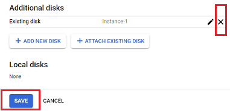  

    * Go back to the VM instances page.  Click on the stopped Nightscout instance name.  Click on Edit.  Scroll down to Boot disk.  Click on Configure boot disk.  
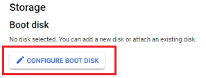  

    * Select "Existing disks".  From the pull-down menu, select the repaired disk you detached from the recovery instance.  Click on "Select".  
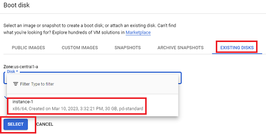  
That takes you to the instance edit page.  Click on Save to finalize the instance edit.  

* 5- Resolution  
    * Go back to the VM instances page.  You can stop the recovery instance now.  Start the Nightscout instance from the 3-dot menu on the right side of the Nightscout instance line.  

    * Click on SSH on the Nightscout instance line.  It should connect and open a terminal.  Don't do anything other than [restarting](./Restart.md) the server from the menu.  

    * After the restart, Nightscout will be up and running again.  Follow these [instructions](./NS_SyncExecutables.md) to update if needed.  

    * You can delete the recovery instance if everything is working.  
  
