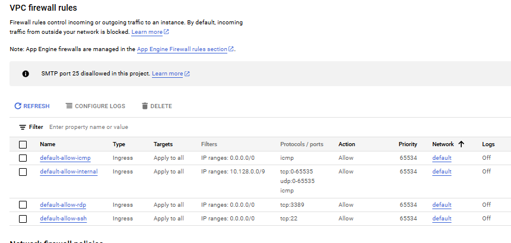

---

---

## Google Cloud Firewall Defaults  
[Google Cloud Nightscout](../../GoogleCloud.md) >> Firewall Defaults  
   

The following image shows the default firewall rules:  
  
  
There is no way to restore the default rules automatically. However, by referring to the image, you can manually recreate all four default firewall rules.  
  
When you create a virtual machine using our instructions, two additional firewall rules are added for HTTP and HTTPS traffic. If you modify any parameters in these two rules, your changes will persist even if you delete your virtual machine and create a new one.  
  
The only way to restore the default HTTP and HTTPS firewall rules is to delete them before creating a new virtual machine.  
  
  
