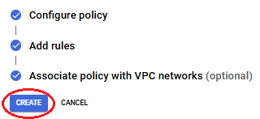

---

---

# Google Cloud Firewall  
[Google Cloud Nightscout](../GoogleCloud.md) >> Firewall  
   
  
Creating a firewall is unnecessary for reducing the cost of unwanted traffic. A simpler approach is to change the network service class from the default premium setting to standard, as explained [here](./SwitchNetworkTier.md). This adjustment effectively eliminates traffic costs.    
  
---  
  
   
   
  
When you create a virtual machine, it has a firewall already.  To see it, go to your Google Cloud [Dashboard](../Dashboard.md).  
From the menu, select `VPC Network` > `Firewall`.  
  
  
If you have followed our instructions to create a virtual machine, you will see the following.  
.  
   
  
---  
  
#### **Firewall rules**  

If you have not created a virtual machine, you will only see the 4 rules at the bottom.  
The two rules at the top are related to the http and https options you are supposed to enable during the virtual machine setup following our instructions.  
   
  
---  
  
#### **Firewall policies**  
If you want to use geo-location, you will need to create a firewall policy.  But, geo-location is not free.  

Delete the http and https rules.  Now, you will not be able to access your site.  Test and verify.  
  
Then, create a firewall policy.  
  
   
   

Give it a name.  Continue.  
  
   

Continue.  
  
   
  
Associate.  
  
   
  
Select "default".  Associate.  
  
   
  
Continue.  
  
   
  
Create.  
    
   
  
Click on firewall policy name.  
  
   
  
Click on Create firewall rule.  
  
   
  
Set priority to 950.  Choose tcp 80 and 443.  Under Geolocations, choose your country and any other country you travel to a lot.  Geolocation is not free.  
  
   
  
You should now be able to access your Nightscout in a browser again.  
  
