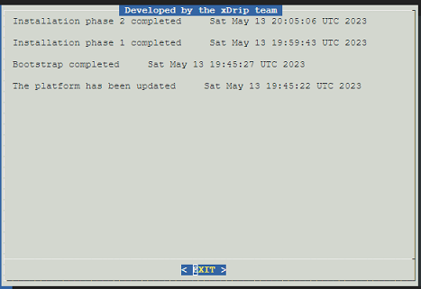

# Google Cloud Nightscout Logs  
[Google Cloud Nightscout](./GoogleCloud.md) >> Google Cloud Nightscout Logs  
  
Logs could be helpful for troubleshooting.  
  
  
You need to have started step 4 under installation [here](./GoogleCloud.md) before logs start to show.  
To see the logs, select "Logs" from the [main menu](./Menu.md).  
  
