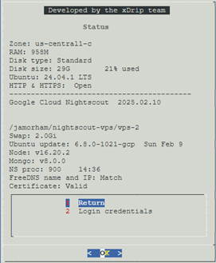
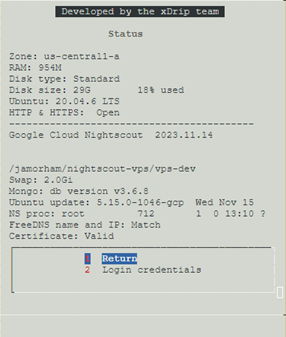
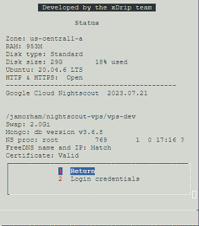
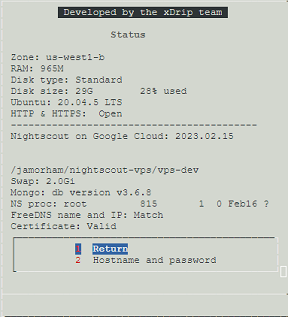
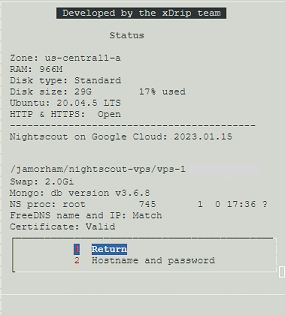
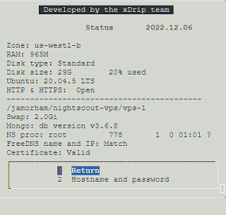
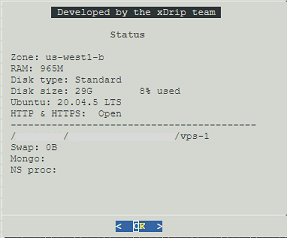
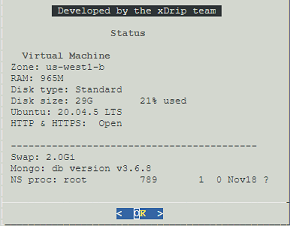
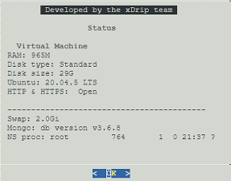
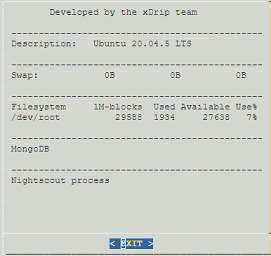

# Google Cloud Nightscout release notes
[Google Cloud Nightscout](./GoogleCloud.md) >> Release notes  
  
The development and stable branches are explained [here](./Branches.md).  
  
| Release | Notes | Status page |  
|---------|-------| ----------- |  
| 2025.08.24 | **Stable release**   Node install exception handling | |  
| 2025.08.20 | Ubuntu 24.04.3 | |  
| 2025.05.19 | NS 15.0.3 | |  
| 2025.03.17 | Cleanup of the installation routine | |  
| 2025.02.27 | Upgrade Ubuntu to 24.04.2 | |  
| 2025.02.14 | Live hyperlinks | |   
| 2025.02.10 | Initial Ubuntu 24 alpha release |  |  
  
   
  
|     | The Ubuntu 20 platform will not be updated any longer. It is a good idea to [upgrade to Ubuntu 24](./GCNS/UpgradeToUbuntu24.md) when you get a chance. |  |  
| ---------- | ----------------------------------------------------- | ------ |  
| 2024.12.29 | Cleanup | |  
| 2024.08.28 | Backup utility update | |  
| 2024.08.20 | Update to Node 16 |  |  
| 2024.02.24 | Upgrade to 11ubuntu5.8 | |  
| 2024.01.29 | Logs fix | |  
| 2023.11.14 | Auto Ubuntu security update status flag |  |  
| 2023.10.27 | Update to Nightscout 15.0.2 | |  
| 2023.09.21 | Status page cleanup | |  
| 2023.09.08 | API_SECRET character verification | |  
| 2023.07.22 | FreeDNS ID/pass status page marker fix | |  
| 2023.07.21 | FreeDNS user ID and password fix |  |  
| 2023.07.17 | FreeDNS user ID and password on the status page | |  
| 2023.05.09 | Upgrade Ubuntu to 20.04.6 | |  
| 2023.04.26 | FreeDNS site failure contingency | |  
| 2023.03.19 |  Single quote variables | |  
| 2023.02.28 | Backup variables also | |  
| 2023.02.20 | FreeDNS dialog update | |  
| 2023.02.15 | Log copy Nightscout |  |  
| 2023.02.11 | Detect incomplete update |  |  
| 2023.01.30 | Development branch setup |  |  
| 2023.01.25 | Minimal Ubuntu detection fix |  |  
| 2023.01.21 | Minimal Ubuntu enforced |  |  
| 2023.01.16 | Submenus |  |  
| 2023.01.07 | Variable server improvements |  |  
| 2022.12.10 | Copy Nightscout improvements FreeDNS capital letters are rejected.   Database size set to 20GB   Utility logs |  |  
| 2022.12.02 | Install heavily dependent on bootstrap now |  |  
| 2022.11.27 | FreeDNS name with capital letters |  |  
| 2022.11.21 | Installation improvements |  |  
| 2022.11.19 | Nightscout 14.2.6 - Verify VM region as well |  |  
| 2022.11.11 | Verify virtual machine |  |  
| 2022.11.08 | Variable edit in a browser |  |  
| 2022.11.06 | FreeDNS menus |  |  
| 2022.10.28 | Filter out MongoDB parameters in copy |  |  
| 2022.10.27 | First main menu |  |  
| 2022.10.14 | Customize Nightscout option | None |  
| 2022.10.13 | Mongo admin - FreeDNS option | None |  
| 2022.09.28 | nginx tweaks | None |  
| 2022.09.26 | Automatic reboot after install | None |  
| 2022.09.23 | Nightscout Clone improvements | None |  
| 2022.09.20 | Nightscout Clone understands tokens | None |  
| 2022.09.19 | 2GB swap | None |  
| 2022.09.14 | Nightscout Clone option | None |  
| 2022.08.30 | First release | None |  
