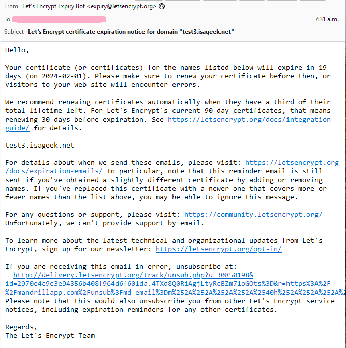

# Why am I asked for an email address?
[Google Cloud Nightscout](./GoogleCloud.md) >> Who is asking for my email address?  
  
During installation, in phase 2, you will be asked to enter an email address.
We are not collecting email addresses.  We don't keep a record of your email address.

We use [Let's encrypt](https://letsencrypt.org/) to create a certificate to allow you to have a web address starting with https for your Nightscout site.  
We also include an auto renewal.  So, the certificate does not expire after 90 days as long as you use your setup.  

But, if you stop using your hostname, you will receive an email reminder that your certificate is about to expire.  
Your email address is given to letsencrypt.  And that's what they use it for.  
The following is a sample email.   
  
  
   
  
If you are not going to use the hostname any longer, you can ignore the email.  

If you are using your site, you should never receive this email for the address of your site.  
If you do, please [contact us](./GCNS_Support.md).  
