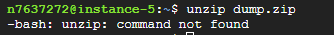
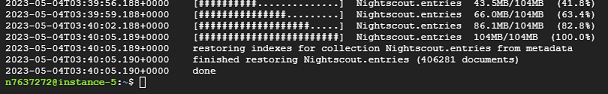

# Import data from other servers
[Google Cloud Nightscout](./GoogleCloud.md) >> Import data from other servers  
  
Regardless of where your Nightscout server is, it uses MongoDB.  MongoDB can create a **mongodump**, which is a binary export of a database’s contents.  
  
Before transferring a database, make sure you have already completed the Nightscout [installation](./NS_Install.md).  
   
  
---  
  
#### **Transfer to the virtual machine**  
You need to transfer the output of mongodump to the virtual machine.  By default, the output is a folder named **dump**. Compress this folder into a single file, then [Upload](./Upload_Download.md) the compressed file to your virtual machine.  
   
  
---  
  
#### **Restore**  
Unzip the file you uploaded to the virtual machine. From your home directory, where the `dump.zip` file should be located, run:    
`unzip dump.zip`  
  
If you see the following message, it means the `unzip` command is not installed:  
  
  
To install it, run:  
`sudo apt-get update`  
`sudo apt-get install unzip`  
  
Then re-run the `unzip` command.  A folder named **dump** should now appear in your home directory.  
  
Restore the data with mongorestore. Replace UserName with the actual user name from the original database:  
`mongorestore -d Nightscout ./dump/UserName`  
   
  
If the restore succeeds, you’ll see output similar to this:  
  
  
Wait about a minute, then reload Nightscout in your browser. Your imported data should now be available.  
  
