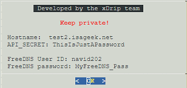

# Google Cloud Credentials
[Google Cloud Nightscout](./GoogleCloud.md) >> What is my Hostname, API_SECRET, FreeDNS ID or password?  
  
If you have forgotten the hostname, the API_SECRET, your FreeDNS user ID, or your FreeDNS password, go to the [status page](./Status.md).  At the bottom, choose `Login credentials`.  
You will be taken to a page where you can see all of those assuming you have completed [installation](./GoogleCloud.md).  An example is shown below.  
  
  
  
