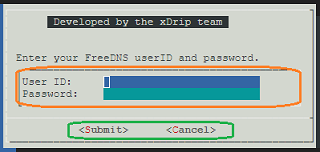
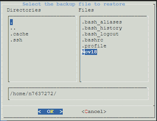

# How to use Google Cloud Nightscout menus
[Google Cloud Nightscout](./GoogleCloud.md) >> How to use Google Cloud Nightscout menus  
  
Menus are available in Google Cloud Nightscout so you can accomplish everything you need without manually entering Linux commands.  The following image shows an example menu:  
  
  
The file selection menu is shown below:  
  
  
To select a file, move the cursor over the desired file name and press the **spacebar**.  Pressing **Enter** alone will not select the file.  Once selected, the file name will appear in the full path at the bottom.  Then press **Enter** to confirm.  
   
  
You may also see notifications. The following image shows an example:  
  
  
To dismiss a notification, simply press **Enter**.  
  
