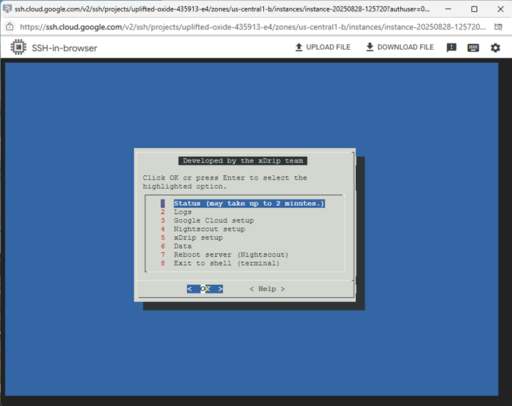
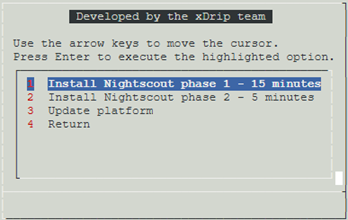
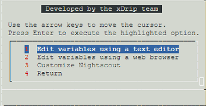
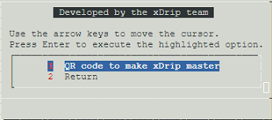
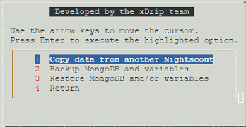

# Google Cloud Nightscout menu
[Google Cloud Nightscout](./GoogleCloud.md) >> Menu  
  
When you open a [terminal](./Terminal.md), the main menu will automatically come up.  
  
  
If no menu appears when you open a terminal, you may need to [update](./NS_SyncExecutables.md) your installation files.  
If the window is too small, some menu items may not display correctly.  It’s best to avoid reducing the window size too much.  
  
We use SSH on Google Cloud to access the virtual machine.  [This](./HowToMenu.md) explains how to use menus.  
  
If you need to use the shell (terminal), select "Exit to shell".  
To return to the menu after, you can open a new terminal, or enter `menu` in the terminal.  
   
   
  
---  
  
#### **Submenus**
There are 4 submenus.  Options 3, 4, 5 and 6 on the main menu take you to those submenus.  
  
Google Cloud setup, main menu option 3  
  
  
Nightscout setup, main menu option 4  
   
  
xDrip setup, main menu option 5  
  
  
Data, main menu option 6  
  
  
  
