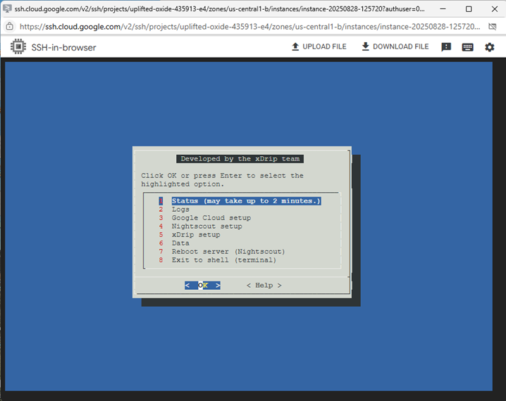
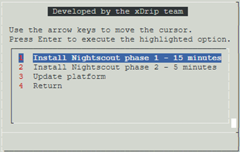
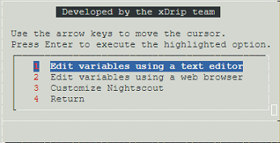
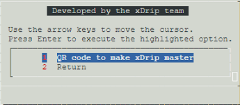
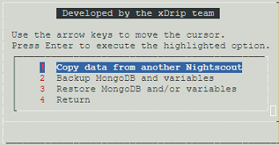
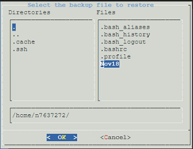

# Google Cloud Nightscout menu
[Google Cloud Nightscout](../) >> [Tips](./GCNS/Tips.md) >> Menu  
  
When you open a [terminal](./Terminal.md), the main menu will automatically come up.  
  
  
If the window is too small, some menu items may not display correctly.  It’s best to avoid reducing the window size.  
  
If you need to use the shell (terminal), select "Exit to shell".  
To return to the menu after, you can open a new terminal, or enter `menu` in the terminal.  
   
   
  
---  
  
#### **Submenus**
Some options on the main menu take you to submenus.  
  
Google Cloud setup submenu  
  
  
Nightscout setup submenu  
   
  
xDrip setup submenu  
  
  
Data submenu  
  
   
  
---  
  
#### **File selection menu**
The file selection menu is shown below:  
  
  
To select a file, click the file name and press the **spacebar**.  Pressing **Enter** alone will not select the file.  Once selected, the file name will appear in the full path at the bottom.  Then click **Enter** to confirm.  
   
