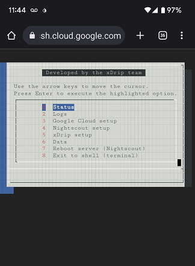
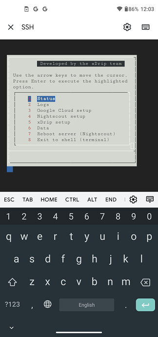

# Virtual machine mobile access
[Google Cloud Nightscout](./GoogleCloud.md) >> Mobile  
  
This is about how to use a mobile device to access your Google Cloud Nighscout.   

---  
**Chrome**  
You can use Chrome on a mobile device to log into Google Cloud, select your project, access the instance and tap on SSH to open the menu.   
Tapping on the menu will open the Android keyboard.  
  
  
The arrow keys may not exist or work.  But, each option on the menu has an effective tag highlighted in red.  Pressing the effective tag on the keyboard selects the corresponding option.  
If multiple options have the same effective tag, pressing the corresponding key repeatedly selects those options in sequence.  
  
Pressing backspace is the same as pressing the escape key.  
On a menu with only yes and no options, you need to type no to select no.  
   
  
---  
**Google Cloud app**  
The main disadvantage of the above method is that since you will not be able to press the ctrl key, you will not be able to edit the Nightscout variables using a text editor.  
But, there is an alternative way using the Google Cloud app (explained below) that is much more graceful.  
Thanks to Bjørn Ole Haugsgjerd (facebook group) for the tip.     
  
Install the Google Cloud app from the play store.  
Tap on "Resources" at the bottom.  Under Compute Engine, tap on VM instances.  Tap on your instance containing your Nightscout installation.  
From the 3-dot menu, tap on "Connect via SSH".  
  
