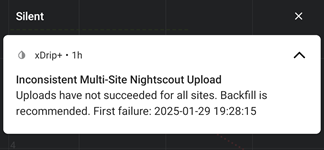

# Inconsistent Multi-Site Nightscout Upload  
[xDrip](../../) >> [Features](../Features_page.md) >> [Nightscout](../Nightscout_page.md) >> Multi-Site Upload Failure  
  
Uploading to a single Nightscout site is generally recommended.  
  
If you choose to upload to multiple sites by entering multiple URLs separated by spaces, xDrip will reset the upload queue as soon as one site upload completes. This may result in missed Nightscout readings if all site uploads are not successful.  
By default, xDrip notifies you when this occurs so that you can backfill the missing uploads.
Below is a sample notification:    
  
  
Although not recommended, you can disable these notifications by navigating to:  
`Settings` > `Clouad Upload` > `Nightscout Sync` > `Extra Options` > `Alert on multi-site upload failure`.  
  
  
