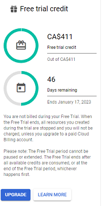

  
# Google Cloud project  
[Google Cloud Nightscout](./GoogleCloud.md) >> Google Cloud project  
  
You will need a Google account, a Google project, and activated billing for the Google project.  We will take care of all that now.  There are also video clips (silent) on this page that may be helpful if the instructions are not clear.  
You will need 5-15 minutes to complete this.  
  
Create a Google account if you don't have one already.  
  
Go to  [https://console.cloud.google.com](https://console.cloud.google.com) and log in with your Google account.  
When you see the welcome message, agree and continue.  
  
  
When you see the free trial offer, activate it.  
  
  
You will be taken to registration for Google Cloud for free.  
Select your country of residence and choose personal project, accept terms, and continue.  
  
  
On the second page, choose individual.  Enter your address.  Enter your credit card details.  Start free trial.  
  
<video width="400" controlsList="nodownload" src="./video/GC.mp4" controls>  
</video>  
   
   
  
You will be asked to describe yourself.  Answer the questions and click on Done.  
  
  
  
By default, a new project titled "My First Project" is created for you.  You can use it or create another.  
  
<video width="400" controlsList="nodownload" src="./video/GC2.mp4" controls>  
</video>  
   
   
  
Click on "Console".  
  
  
Go to dashboard.  
  
  
Select "Compute Engine".  
  
  
Enable.  
  

If you didn't take care of entering your credit card details already, you will be asked for it now.  Enter the details and enable billing.  
  
<video width="400" controlsList="nodownload" src="./video/GC3.mp4" controls>  
</video>  
   
    
  
Go to Google Cloud Billing.  On that page, you can see your free  trial credit.  Click on upgrade.  
  
  
That will bring up the form shown in the following image.  Click on Activate.  
  
  
Your free trial credit will remain available until you use it or its expiry date.  
As long as you satisfy the free tier requirements, everything will be free.  
  
