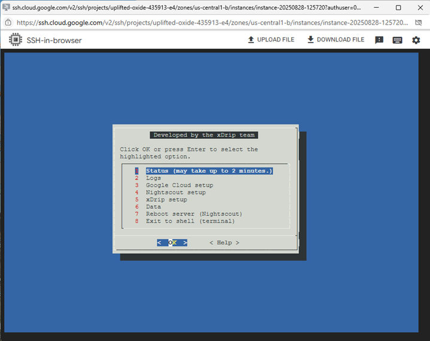

# Linux/Nightscout install  
[Google Cloud Nightscout](./GoogleCloud.md) >> Linux/Nightscout install  
  
Now, we will update Linux on our virtual machine and install Nightscout on it.  You must have [FreeDNS](./FreeDNS.md) and a [Google Project](./NS_GCProject.md) set up, and you should have already created a [virtual machine](./VirtualMachine.md) to proceed.  There are also video clips on this page that may be helpful.  
   
  
---  
  
**Bootstrap**  
Estimated time: 5-10 minutes  
  
Open a [terminal](./Terminal.md).  
  
Copy and paste the following highlighted line into the terminal of your Nighscout virtual machine, then press **Enter**.  
⚠️**Caution:** Be very careful not to copy this into any other computer, as it could overwrite its contents.  
  
<input type="text" value="curl https://raw.githubusercontent.com/jamorham/nightscout-vps/vps-2/bootstrap.sh | bash" readonly id="myInputText" style="border:none; color:#101010; background-color:#ededed; width:100%; font-size:15px">  
<button onclick="FunctionCopyText()" style="border: 1px solid #0066ff; color:#f0f0f0; background: linear-gradient(#0066ff, #0066ff); font-size:14px; background-color:#0066ff; font-weight:400; border-radius: 2px; margin-left:70px; margin-top:8px; padding:4px 12px; display:inline-block; box-shadow: inset 0px 1px 0px rgba(255,255,255,.3), 0px 1px 5px rgba(0,0,0,.7); :hover ">Copy</button>  
  
   
  
You will see a notification. Click **OK** to acknowledge it.  
This step will take a few minutes to complete. You will then see either a note or a status page.  
The following table shows possible messages and their meanings:  
  
| Incorrect choice | Clue | Outcome |  
| :--------------: | :----------: | :-----: |  
| Nothing |  | All good ✅ |  
| Region |  | Not free ❌ |  
| Machine type |  | Not free ❌ |  
| Disk type |  | Not free ❌ |  
| Disk size |  | Unused resource   Not free ❌ |  
| Firewall |  | Disconnect ❌ |  
| Ubuntu |  | Incompatibility ❌ |  
  
If the note directs you to create a new virtual machine, or if any item above the horizontal line on the status page is red, it means you made an incorrect selection during the virtual machine setup.  If this is a new virtual machine with no database yet, [delete the virtual machine](./DeleteVM.md) and repeat the [virtual machine step](./VirtualMachine.md).  
  
If you did not get a notification to recreate the machine due to an incorrect Ubuntu version and nothing is red above the horizontal line on the status page, click **OK** to close it.  Any red notes below the horizontal line are expected at this stage and can be ignored.  
You will see this menu:  
  
  
<video width="400" controlsList="nodownload" src="./video/Install1.mp4" controls>  
</video>  
   
  
If you need a break, this is a good time.  
   
   
  
---  
  
**Phase 1**  
You must complete the Bootstrap strap before proceeding.  
Estimated time: 15-20 minutes  
  
To continue the installation, go to the **Google Cloud setup submenu**, select **Item 1 - "Install Nightscout Phase 1"**, and press **Enter**.  
- This step will take about 15 minutes.
- If SSH disconnects and you see a disconnect message, please reconnect and run "Install Nightscout Phase 1" again.
- Some error messages are expected and can be ignored.
  
  Please be patient while the process completes.  
  
<video width="400" controlsList="nodownload" src="./video/Install2.mp4" controls>  
</video>  
   
  
If you need a break, this is a good time.  
   
   
  
---
  
**Phase 2**  
You must complete Phase 1 before proceeding.  
You will be asked to provide an email address at this stage.  See [this page](./GC_WhyEmail.md) if you're wondering why.  
Estimated time: 10-15 minutes  
  
To proceed, go to the **Google Cloud setup submenu**, select **Item 2 "Install Nightscout Phase 2"**, and press **Enter**.  
  
- You will be asked to choose an **API_SECRET**, which is required to access Nightscout.
- Choose a password that **excludes** the following characters, or select **Cancel** to keep the existing one.  
  
$ &nbsp; &nbsp; \" &nbsp; &nbsp; \' &nbsp; &nbsp; \\ &nbsp; &nbsp; SPACE &nbsp; &nbsp; @ &nbsp; &nbsp; / &nbsp; &nbsp; %  
  
   
  
You will be prompted to enter your **FreeDNS user ID and password**.  
  

- Your user ID is **not** your email address.  
- If you don't remember your FreeDNS user ID, log into [FreeDNS](https://freedns.afraid.org/menu/), where your user ID will be displayed in the right pane at the top.  
- Alternatively, check the verification email from FreeDNS when you first signed up.  
  
After entering your user ID and password, press **Enter** to submit.  
If you have multiple subdomains, you will be asked to specify the one you want to use. Enter the first few characters of your subdomain and press **Enter**.  
  
#### **Handling Errors**  
If you see a message directing you to exit and retry due to an **internal error**, follow these steps:  
1- Exit and try again.  
2- If prompted about an [existing certificate](./ExistingCertificate.md), choose option **2**.  
3- If you are asked to retry again, close the window.  
4- Open a new terminal window.  
5- From the menu, select **Reboot server**.  
6- Wait **30 seconds**, then click **Retry** to reconnect.  
7- Run **Install Nightscout Phase 2** again.  
  
You may also encounter an error about [too many requests](./TooManyCertificates.md).  Follow the provided instructions in that case.  
  
#### **Final Steps**  
1- After a successful setup, enter an email address for security notices when prompted.  
2- Once restarted, you will see a disconnect message. Wait 30 seconds, and Nightscout will be running.  
3- To verify successful phse 2 completion, check the logs on the main menu.  
  
If this is a new site, you will still need to set up your uploader.  
  
<video width="400" controlsList="nodownload" src="./video/Install4.mp4" controls>  
</video>  
   
  
This is a good time to take a break if needed.  
  
