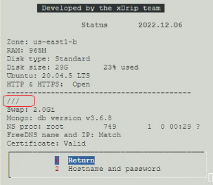
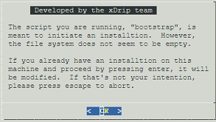
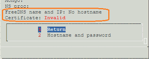

# Update Google Cloud Platform
[Google Cloud Nightscout](./GoogleCloud.md) >> Update to latest release  
  
We update the Google Cloud Nightscout platform in order to add functionality and fix issues.  This is how you can update your platform to access 
 those improvements.  
If you have not completed the [installation](./GoogleCloud.md), please complete it first.  
  
Open a [terminal](./Terminal.md).  A [menu](./Menu.md) should come up automatically.  Select `Update platform` from the Google Cloud setup submenu.  You can then check the status page to confirm that your setup has been updated by comparing it to [this](./Status.md).  
  
If you created your setup prior to January 2023 and never updated it, you will not have the same menu options.  In that case, please follow the instructions explained in a corresponding section below first.  
   
    
  
If a menu does not open when you open a terminal, please skip to the "Bootstrap" section below.  
  
If a menu opens when you open a terminal, from the menu, or Google Cloud setup submenu, select "Update scripts" or "Update platform".  After completion and closing the terminal and opening a new one, if a menu does not automatically open up, please skip to the "Bootstrap" section below.  
  
View the Status page by selecting `Status`.  If it looks like [this](./images/Status.png), the platform has updated to the latest.  If not, please update platform from the Google Cloud setup submenu again.  
  
If the status page still looks different, for example, if the username, repository name and branch name are blank, as shown below, please proceed to the "Bootstrap" section below.  
  
   
  
---  
  
#### **Bootstrap**  
  
If you have upgraded to Ubuntu 24, copy the highlighted text below and paste into the [terminal](./Terminal.md).  Press enter.  
  
<!-- First input and button -->  
<input type="text" value="curl https://raw.githubusercontent.com/jamorham/nightscout-vps/vps-2/bootstrap.sh | bash" readonly  
       id="myInputText1"  
       style="border:none; color:#101010; background-color:#ededed; width:100%; font-size:15px">  
<button onclick="copyText('myInputText1', 'msg1')"   
        style="border: 1px solid #0066ff; color:#f0f0f0; background: linear-gradient(#0066ff, #0066ff); font-size:14px; font-weight:400; border-radius: 2px; margin-left:70px;  margin-top:8px; padding:4px 12px; display:inline-block; box-shadow: inset 0px 1px 0px rgba(255,255,255,.3), 0px 1px 5px rgba(0,0,0,.7);">Copy</button>  
Copied!  
  
   
  
If you are still running Ubuntu 20, copy the highlighted text below instead and paste into the terminal.  Press enter.  
  
<!-- Second input and button -->
<input type="text" value="curl https://raw.githubusercontent.com/jamorham/nightscout-vps/vps-1/bootstrap.sh | bash" readonly 
       id="myInputText2" 
       style="border:none; color:#101010; background-color:#ededed; width:100%; font-size:15px">
<button onclick="copyText('myInputText2', 'msg2')" 
        style="border: 1px solid #0066ff; color:#f0f0f0; background: linear-gradient(#0066ff, #0066ff); font-size:14px; font-weight:400; border-radius: 2px; margin-left:70px; margin-top:8px; padding:4px 12px; display:inline-block; box-shadow: inset 0px 1px 0px rgba(255,255,255,.3), 0px 1px 5px rgba(0,0,0,.7);">Copy</button>
Copied!
  
   
  
You will see the following note:  
  
Press enter to proceed.  After bootstrap is complete, you will go to the status page.  
You must now run `Install Nightscout phase 1` from the Google Cloud setup submenu.  
Please proceed to the following sections.  
   
  
---    
  
#### **No Hostname**
If you are still using noip.com, after you run bootstrap and run `Install Nightscout phase 1`, you will see "No hostname" on the status page as shown below.  
  

  
To switch to FreeDNS, please follow the instructions [here](./FreeDNS.md) to create a FreeDNS account and create a new hostname.  
Then, please run "Install Nightscout phase 2" from the Google Cloud setup submenu.  
     
  
