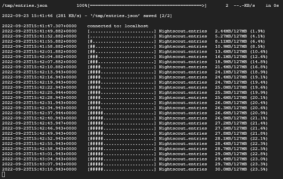

# Data transfer from another Nightscout
[Google Cloud Nightscout](./GoogleCloud.md) >> Data Transfer  
  
This is how you can transfer your past readings from another repository, for example, from Heroku.    
  
Open a [terminal](./Terminal.md).  
Select "Copy data from another Nightscout" from the Data submenu and Enter.  
  
You will be asked for site name.  Enter the URL you use to access the source Nightscout site.  For example, https://UserId.herokuapp.com of Heroku.  
You will be asked for a read token.  If the source Nightscout is open to the world, not recommended, you can just hit enter.  If it's not, enter a read token.  You can see [here](./NS_Followers.md) how to create and use tokens.  
  
After you enter the token, the transfer will start.  
  
  
It may take a while to complete depending on how much data you have in the previous repository.    
  
