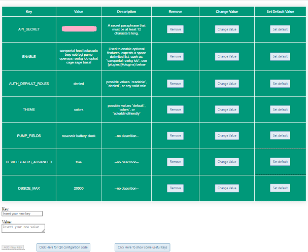
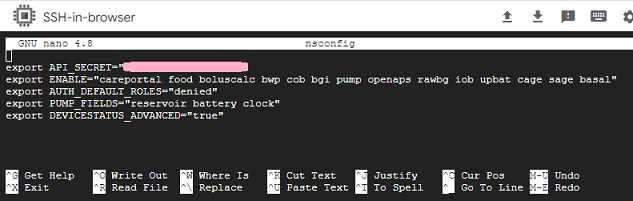

# Nightscout variables  
[Google Cloud Nightscout](./GoogleCloud.md) >> Variables  
  
After [setting up Nightscout](./NS_setup.md), you can edit your Nightscout variables if needed.  For any change to the variables to take effect, you will need to [reboot the server](./Restart.md).  
  
If anything breaks, you can edit the file again and change it back.  Or, you can rerun install Nightscout phase 2 from the Google Cloud setup submenu.  
To edit your Nightscout variables, open a [terminal](./Terminal.md).  
  
---  
  
**Using a web browser**  
Select "Edit variables in a browser" in the Nightscout setup submenu.  
Be patient.  You will be presented with a link to click on.  
You will see the variable edit page as shown next.  
  
  
You will have 15 minutes to use the browser to edit the variables.  You can add variables, edit or delete them.  
After you are done, you can just close the browser.  You will need to restart the server (Nightscout).  After a restart, the edited variables will be in effect.  
  
---  
  
**Using a text editor**  
Select "Edit variables using a text editor" in the Nightscout setup submenu and enter.  
  
This will open, using nano, the file containing the variables for edit.  
  
To save, press ctrl and O at the same time.  It will offer the same name to save the file.  Press enter to approve.  Or, enter a different name to create a copy.  
To exit, press ctrl and X at the same time.  
  
After you are done editing and saving the file, you will need to reboot the virtual machine. To do that, select "Reboot server" from the menu and enter.  
  
Rebooting the machine will disconnect you and you will see an error message in the terminal. Just close the terminal.  
If you haven't done anything destructive, your Nightscout will keep going.  
   
   
  
---  
  
[All Nightscout variables and their definitions](https://github.com/nightscout/cgm-remote-monitor/blob/master/README.md#environment)  
   
  
---  
  
For troubleshooting, if you want to temporarily allow anyone who has your hostname to be able to access your Nightscout, you need to change the following line:  
export AUTH_DEFAULT_ROLES="denied"  
Change denied to readable.  

  
