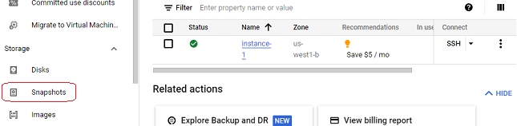
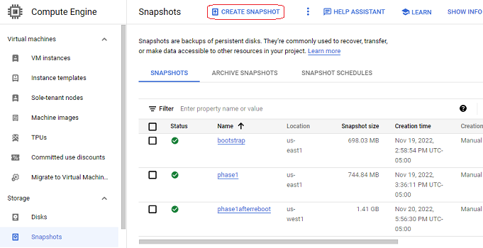
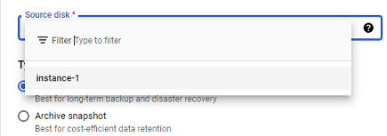
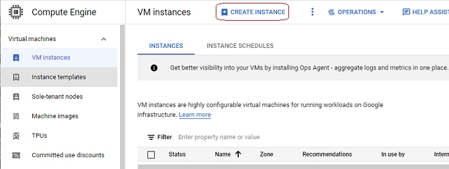
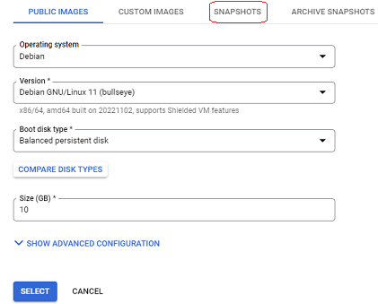
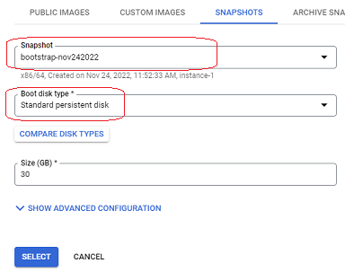

# Google Cloud snapshots
[Google Cloud Nightscout](./GoogleCloud.md) >> Snapshots  
  
Creating a snapshot of your virtual machine (VM) disk on Google Cloud (note: this is [not free](./SnapshotCost.md)) can be a helpful tool for managing your environment.  If you encounter issues while experimenting, you can restore the snapshot to revert the disk to its state at the time the snapshot was created. However, keep in mind that any data added to the database after the snapshot was taken will be lost. Therefore, use this utility with that consequence in mind.   
   
  
---  
**[Disabling a snapshot schedule](./GCNS/DeleteSnapshotSchedule.md)**  
   
  
---  
**Creating a Snapshot**  
Follow these steps to create a snapshot of your virtual machine disk:  
1- Navigate to the Compute Engine page and click on Snapshots in the left-hand pane.  
  

2- Click on Create Snapshot at the top of the page.  
  
  
3- From the drop-down menu under "Source disk", select the disk associated with your virtual machine.  
  

- If you have recently completed an installation phase and see nothing in the drop-down menu, return to the dashboard and navigate back to the snapshot creation page.
  
4- Assign a name (use lowercase letters only) to the snapshot so it’s easy to identify later.  
  
  
5- Click "Create" at the bottom of the page.  
  
- The time required to create the snapshot depends on the amount of data on the disk. For a fresh installation with no database imported, the process usually takes about a minute.  
   
  
---  
  
**Snapshot Costs**  
Keep in mind that creating and storing snapshots incurs [costs](./SnapshotCost.md). Be sure to monitor your usage and budget accordingly.  
   
  
---  
  
**Restoring a Snapshot**  
Let’s walk through the steps to restore a snapshot.  
  
- **WARNING:** To comply with the free tier limits, you can only run one virtual machine at a time. Before restoring a snapshot, you must stop your existing machine. Note that even if the instance is stopped, the attached disk may still incur charges.  
  
1- If you plan to delete your current machine:  
- Do not delete the machine if it contains important data.
- Back up your Nightscout database, and copy the backup file from the virtual machine to your local computer before proceeding.
- Delete the machine only when you’re sure no data will be lost. You can manage this under the VM Instances tab.   
  
2- Click on Create Instance.  
  
  
3- Select a region:
- The region must match the region where the snapshot was created. You can find this information under the Location heading on the snapshot details page.  
  
4- Choose e2-micro as the machine type.  
  
5- Under Boot disk, click on Change.  
- At the top of the menu, select Snapshots.  
  
- Choose your snapshot.
- Change the disk type to Standard (the default setting is Balanced). Click Select.  
  
  
6- Under Firewall Options, enable Allow HTTP traffic and Allow HTTPS traffic.  
  
7- Click Create at the bottom of the page. Wait for the instance to be created.  
  
8- Once the machine is created, click on SSH to open the terminal and access the menu.  
  
9- Use the Status option in the terminal to verify that your machine complies with free tier settings.  
  
