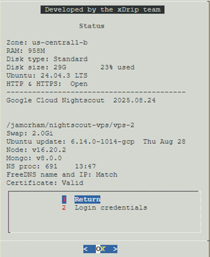

# Google Cloud Nightscout Status
[Google Cloud Nightscout](./GoogleCloud.md) >> Status page  
  
Avoid shrinking the SSH window too much, as the menus may not function properly.  From the [menu](./Menu.md), select Status.  A page will appear showing details about your machine and its configuration.  
  
This information can be helpful when troubleshooting your Nightscout setup.  
   

If the status page displays any red items, refer to [this page](./StatusKey.md) to understand their meaning and how to resolve them.  
  
