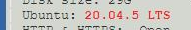

# Status page keywords
[Google Cloud Nightscout](./GoogleCloud.md) >> Google cloud Nightscout status page keywords  

**Please complete all installation phases before using this page.**  
After completing all installation phases, the [status page](./Status.md) displays essential diagnostic information that can help identify potential issues in the event of a malfunction.  
If you encounter any problems, it is recommended to [restart the server](./Restart.md), as this may resolve certain issues.  
When requesting assistance, please include a screenshot of the status page to facilitate troubleshooting.  
  
The following table lists various keywords that may appear on the status page, along with their descriptions.  
Ensure all installation phases are completed before referring to this page.    
  
| &nbsp;&nbsp;&nbsp;&nbsp;&nbsp;&nbsp;&nbsp;&nbsp;&nbsp;&nbsp;&nbsp;&nbsp;Marker&nbsp;&nbsp;&nbsp;&nbsp;&nbsp;&nbsp;&nbsp;&nbsp;&nbsp;&nbsp;&nbsp;&nbsp; | Meaning  | Solution | Notes |  
| ------ | ------- | -------- | ------ |  
|  | Disk size less than 30GB | [Resize disk](./FullDisk.md) | |  
|  | Must complete phase 2 | Install Nightscout Phase 2 from the Google Cloud setup submenu. | If you never completed installation |  
|  | Dormant FreeDNS | [Extend account](./FreeDNS_Min_Login.md) | If you had a fully functional Nightscout before this |  
|  | Broken domain | Create a new subdomain and [switch](./ChangeHostname.md) | If you had a functional Nightscout, and your FreeDNS account has not gone dormant |  
|  | New packages available | [Update platform](./NS_SyncExecutables.md) | 1 |  
|  | Incomplete update | [Update platform](./NS_SyncExecutables.md) | |  
|  | Must complete bootstrap | Install Nightscout phase 1 from the Google Cloud setup submenu. | |  
|  | Are you still using noip.com? | Follow [this](./FreeDNS.md) and then install Nightscout Phase 2 from the Google Cloud setup submenu. | 1 |  
|  | Did installation phase 2 fail? | You can try again.  Or, see if [this](./TooManyCertificates.md) is relevant. | 1 |  
|  | You cannot restart the server if the FreeDNS site is down. | Install Nightscout Phase 2 from the Google Cloud setup submenu. | 1,&nbsp;2 |  
|  | API_SECRET inadvisable characters | More on this [here](./API_SECRET_Inadvisable.md) | |  
|  | Credentials accessible via the status page may be invalid | | 1 |  
  
1 - During installation, you can ignore these markers.  But, they must be fixed if you see them after all installation phases have been completed.  
2 - You don't have to choose a different API_SECRET.  If you are happy with your existing API_SECRET, choose cancel when you are asked to change it.   
  
