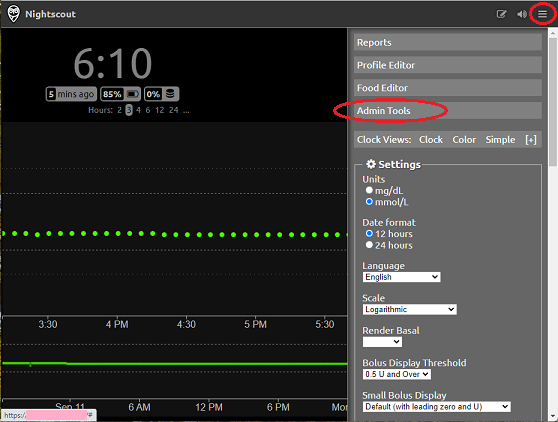
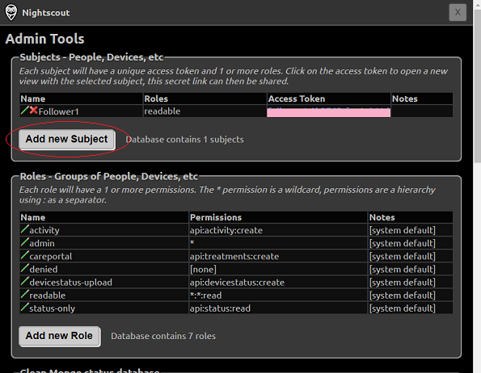
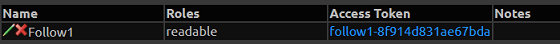

# Nightscout Tokens  
[xDrip](../../) > [F.A.Q.](../FAQ_page.md) > Nightscout Tokens  
  
You can create a token to share with a follower instead of giving them your API_SECRET.  
If you ever decide to stop sharing with someone, removing a token is much easier than changing your API_SECRET.  
   

---  
  
#### **Steps to Create a Nightscout Token:**  
  
1- Use a web browser to access your Nightscout.  
  
2- Click on the top right menu button and select `Admin Tools`.  
  
  
3- Click on `Add new Subject`.  
  
  
4- In the form that opens, enter a name. Under Roles, enter `readable`.  Other options are listed in the table above.  
  
- To assign multiple roles, separate them with commas.  
- Optionally, add a comment, and save.  
- Take note of the access token.  
  
*An example of a token with read-only permissions is shown below.*  
  
  
5- You can create multiple tokens with specific permissions for different followers.  
  
