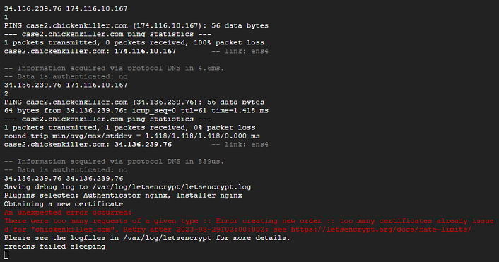

# Unexpected error - Too many requests of a given type
[Google Cloud Nightscout](./GoogleCloud.md) >> There were too many requests of a given type  
  
  

If you encounter this error while running install Nightscout phase 2, it means that installation cannot be completed for the domain you have attempted to use.  
But, this is temporary.  
This could happen if the domain you are trying to use is very popular.  
  
You can create another subdomain on another domain without deleting the one that failed.  You can have a total of 5 different subdomains in your FreeDNS account for free.  
You can then run Install Nightscout phase 2 again.  When it asks you to enter API_SECRET, you can just press escape to skip and keep the existing API_SECRET you entered previously.  
Then, choose to use the new subdomain to complete the installation.  

In 24 hours or more, you can try again with the original subdomain that failed if you really prefer to use it.  Eventually, you will be able to complete the installation without an error.  
Or, you can just keep using your new hostname and forget about the original that failed.  
  
