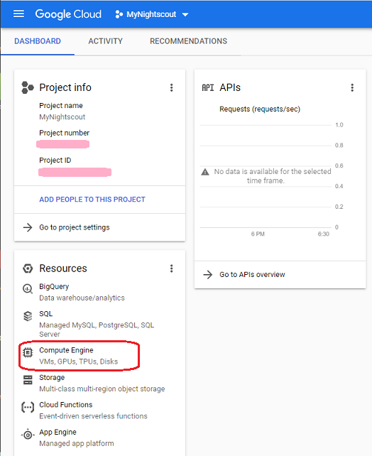

# Google Cloud Nightscout Troubleshooting
[Google Cloud Nightscout](./GoogleCloud.md) >> Troubleshooting  
  
If you cannot log into your virtual machine, it is possible that it has stopped.  See the following section.  
   
  
---  
  
#### **Stopped virtual machine**  
Go to [Google Cloud](https://cloud.google.com/).  Sign into Google.  
Click on Console.  
  
  
Go to dashboard.  
  
  
Select "Compute Engine".  
  
  
You should see something like what is shown below with a checkmark under status.  
  
  
But, if you see something like what is shown below with a square symbol (stop) under status, it means your virtual machine has stopped.  
  
  
If you see that, please click on the 3-dot drop-down menu and select "Start".  
  
   
   
  
---  

#### **Restart the server**  
There are actions that require a restart after.  For example, any update that changes the startup routine needs a restart to complete.  If you have forgotten to restart when you should have, it could be the cause of the problem.  
If you can log into your virtual machine, but Nightscout is not running, [restart](./Restart.md) now.  
Restarting the server is harmless and can resolve many issues.  So, it should be the first step in troubleshooting.  
   
   
  
---  
  
#### **Status page**  
After you restart the server, Nightscout will not be running immediately.  It may need a minute to start operation.  
If it's still not running after you wait a minute, look at the [status page](./Status.md).  
If there is nothing in red on the status page, install Nightscout phase 1 from the Google Cloud setup submenu.  
Then, [restart](./Restart.md).  
   

---  
  
#### **Status page flags**  
If you see items in red on the status page, look at the [status page flags](./StatusKey.md) and follow the instructions.  
  
  
