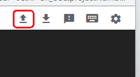
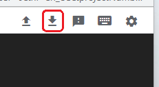

# Google Cloud VM Upload/Download
[Google Cloud Nightscout](./GoogleCloud.md) >> Upload or Download files  
  
To upload or download a file to/from the virtual machine, you need to open a [terminal](./Terminal.md).  
   
  
---  
  
#### **Upload**  
Click on Upload file at the top on the terminal.  
  
Click on “Choose Files”.  Select the file you want to upload and click on “Upload Files”.  
You will be able to see the upload progress.  If SSH crashes, and you see a [disconnect error](./ConnectionFailed.md),  during the upload, it will fail and you will need to repeat.  
After the upload completes, you will be able to find the file in your home directory on the virtual machine.  
   
  
---  
  
#### **Download**  
You will need to know the full path to the file you want to download.  In the terminal, if you go to the directory containing the file and type and enter pwd, you will see the full path to the directory.  
Click on download at the top on the terminal.  
  
Enter the full path to the file you want to download.  For example, if the file is called file2 and is located at /home/jane, the full path will be /home/jane/file2.  
With the full path entered, click on “Download”.  
You will be able to see the download progress.  If SSH crashes, and you see a [disconnect error](./ConnectionFailed.md),  during or before the download, it will fail and you will need to repeat.  

