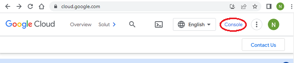
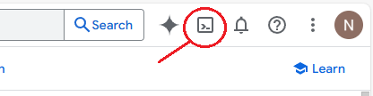

  
# Google Cloud Virtual Machine  
[Google Cloud Nightscout](../) >> Virtual Machine  
   
In this guide, we will create a free virtual machine in your [Google project](./NS_GCProject.md).  Each Google account is eligible for one free virtual machine.  
For additional assistance, a video clip on this page may be helpful. This process takes about 2 minutes.  
   
  
---  
  
### ⚠️ WARNING!  
This virtual machine is strictly for hosting Nightscout. Do not use it for work, banking, trading, shopping, or development.   
   
  
---  
  
After signing into Google Cloud, click "Console".  
  
  
From the menu, select "Compute Engine > VM instances".  
If you already have a virtual machine and proceed to create another, it will not be free.  
If you are considering deleting your existing virtual machine, see [this section](./DeleteVM.md) for guidance.  
  
Click the Cloud Shell button at the top right corner of the page.  
  
  
Authorize when prompted.  
The Cloud Shell window will open at the bottom.  
  
Copy and paste the following highlighted line into the Cloud Shell you opened, then press **Enter**.  
  
<input type="text" value="curl https://raw.githubusercontent.com/jamorham/nightscout-vps/vps-2/create_vm.sh | bash" readonly 
  id="myInputText1"
  style="border:none; color:#101010; background-color:#ededed; width:100%; font-size:15px">  
<button onclick="copyText('myInputText1', 'msg')"
  style="border: 1px solid #0066ff; color:#f0f0f0; background: linear-gradient(#0066ff, #0066ff); font-size:14px; background-color:#0066ff; font-weight:400; border-radius: 2px; margin-left:70px; margin-top:8px; padding:4px 12px; display:inline-block; box-shadow: inset 0px 1px 0px rgba(255,255,255,.3), 0px 1px 5px rgba(0,0,0,.7); :hover ">Copy</button>  
  Copied!  
  
   
  
You will be asked to enter a name for the new virtual machine.  You can simply press Enter to accept the suggested name, or type your own.  
Confirm the creation of the machine.  
Your virtual machine will then be created.  
If you see an error message similar to the following, run the script again:  
> The zone 'projects/PROJECT_ID/zones/ZONE' does not have enough resources available to fulfill the request.
Try a different zone, or try again later.  
  
Create only one machine.  If you accidentally created more than one, [delete](./DeleteVM.md) the extra machines.  
  
<video width="400" controlsList="nodownload" src="./video/VM2.mp4" controls>  
</video>  
  
