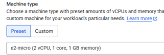
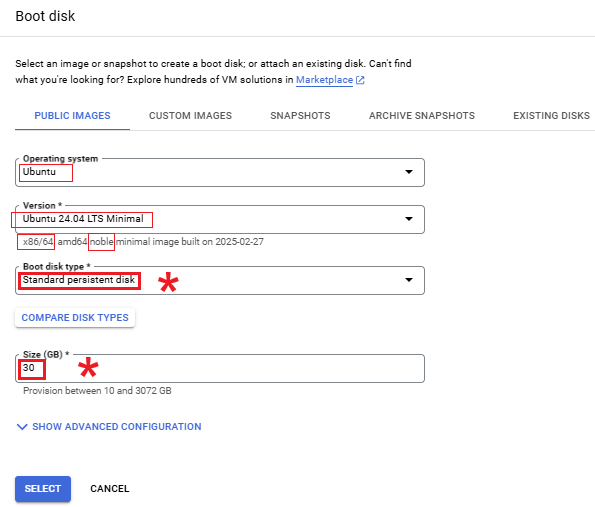
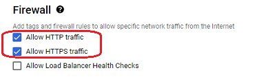

  
# Google Cloud Virtual Machine  
[Google Cloud Nightscout](./GoogleCloud.md) >> Virtual Machine  
   
In this guide, we will create a free virtual machine in our [Google project](./NS_GCProject.md).  Each Google account is eligible for one free virtual machine.  
For additional assistance, a video clip on this page may be helpful. This process takes around 5 minutes.  
   
  
---
  
### ⚠️ WARNING!  
This virtual machine is strictly for hosting Nightscout. Do not use it for work, banking, trading, shopping, or development.   
   
  
---  
  
Go to "Compute Engine"  &#8594; "VM Instances".  
  
Select "Create Instance".  
  
  
Select all the items mentioned below.  Leave everything else as is.  
   
  
---
  
#### **Machine configuration**  
Select a region that qualifies for free tier.  Those are ,  or .  
  
Set machine type to "e2-micro".  
  
   
  
----  
  
#### **OS and storage**  
Under "OS and storage", click on Change and modify as shown below.  
  
  
Click on "Select".  
   
  
---  
  
#### **Data protection**  
Under Data protection, choose "No backups".  
   
  
---  
  
#### **Networking**  
Under "Firewall", enable both http and https.  
  
  
Under "Network interfaces", click on "default".  In the fields that appear, under "Network Service Tier", select "Standard".  
Click on "Done".  
  
   
  
---  
  
#### **Required Configuration Checklist**  
Before clicking on create,  ensure the following settings are correct:  
  
| Parameters | Requirements | Why |  
| ---------- | ------------ | ---- |  
| Machine Region    | Oregon, Iowa or South Carolina | Free Tier |  
| Machine Type | e2-micro | Free Tier |  
| Disk type    | persistent disk | Free Tier |  
| Disk size   |  Less than or equal to 30GB | Free Tier |  
| Operating system | Ubuntu | Compatibility |  
| Version | 24.04 LTS Minimal x86 /64, amd64 noble ... | Nightscout compatibility |  
| Data protection | No backups | Free |  
| Firewall | Allow HTTP traffic | Nightscout access |  
| Firewall | Allow HTTPS traffic | Nightscout access |  
| Network Service Tier | Standard | Free |  
  
   
  
---  

Click on "Create" to create the virtual machine.  Google will now initialize your virtual machine.  Wait for it to come up.  It could take a minute.  When the external IP column appears, you should be good to go.  Your virtual machine is now ready! 🎉  
   
  
<video width="400" controlsList="nodownload" src="./video/VM.mp4" controls>  
</video>  
  
   
   
  
---  
    
The estimate shown at the top right on the same page will not be 0.  As long as you satisfy the conditions listed in the above table, it's OK.  You can ignore that non-0 estimate.  
You can also use the [calculator](https://cloud.google.com/products/calculator) to confirm the price.  
  
   
   
  
---  
  
### ❌ Handling Virtual Machine Creation Errors  
If you see a red exclamation mark after creating your virtual machine and hovering over it shows an error message stating that the instance is unavailable, follow these steps:  

1- Dismiss the request by clicking the trash can icon on the right.  
2- Reattempt creation in a different region.  
3- Unfortunately, you will need to reconfigure all settings from scratch for the new request.  
   
   
  
---  
  
  
