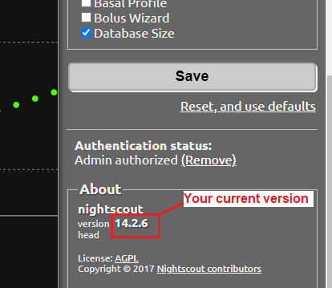

# Update Nightscout
[Google Cloud Nightscout](./GoogleCloud.md) >> Update Nightscout  
  
To check your current version of Nightscout, open it in a browser, click the hamburger menu button, and scroll down to the “About” section. The Nightscout version will be listed there.  
  
  
To see if an update is available, visit the Google Cloud Nightscout website. The version listed in parentheses indicates the latest version available through a fresh installation or update. If your current version is older, follow the steps below to update.  
  
**Note:** You must have already completed the initial Nightscout [installation](./NS_Install.md) steps before attempting an update.  
   
  
---  

#### **How to update**  
Follow these [steps](./NS_SyncExecutables.md) to update your virtual machine platform to the latest version. Once the process is complete, your Nightscout will be updated.  
   

---  

#### **What if no update is available?**  
After a new Nightscout version is released, there may be a brief delay before the update becomes available.  

We recommend being patient while testing is completed and the updated installation process is released. If you’re unsure or need further assistance, feel free to [reach out to us](./GCNS_Support.md).  
  
